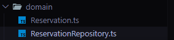
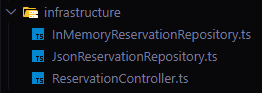
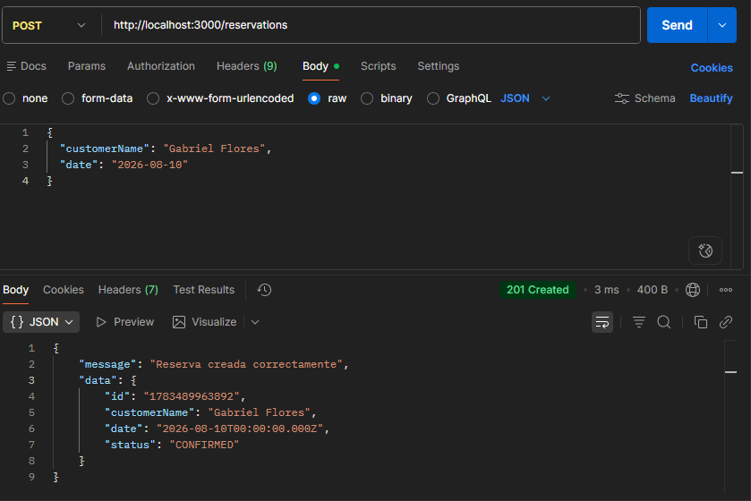
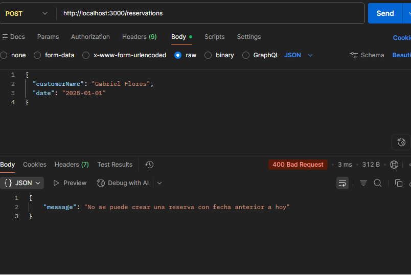
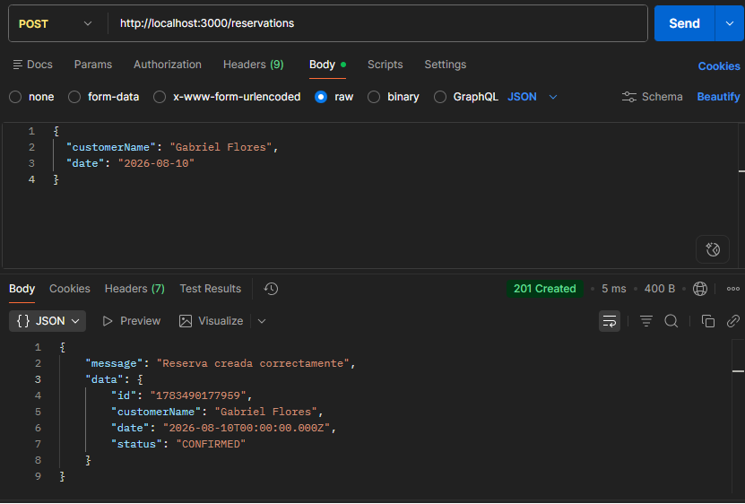
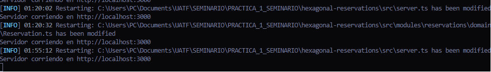

# Práctica 1: Implementación de Arquitectura Hexagonal

## Autor

**Nombre:** Jose Gabriel Flores Cardozo
**Materia:** Seminario
**Práctica:** Implementación de Arquitectura Hexagonal

## Sistema de Reservas

Este proyecto corresponde a la **Práctica 1 de Seminario**, donde se implementa un backend sencillo para un sistema de reservas aplicando los principios de la **Arquitectura Hexagonal**, también conocida como **Puertos y Adaptadores**.

El objetivo principal es separar correctamente la lógica de negocio de los detalles técnicos como frameworks, bases de datos o controladores HTTP.

---

## Objetivo de la práctica

Desarrollar un módulo de reservas donde la lógica principal del sistema esté aislada de la infraestructura.

Esto significa que el dominio y los casos de uso no dependen de Express, bases de datos, archivos JSON ni ningún framework externo.

---

## Tecnologías utilizadas

- Node.js
- TypeScript
- Express
- ts-node-dev

---

## Estructura del proyecto

```txt
src/
├── server.ts
└── modules/
    └── reservations/
        ├── domain/
        │   ├── Reservation.ts
        │   └── ReservationRepository.ts
        ├── use-cases/
        │   └── CreateReservationUseCase.ts
        └── infrastructure/
            ├── InMemoryReservationRepository.ts
            ├── JsonReservationRepository.ts
            └── ReservationController.ts
```

---

## Explicación de la arquitectura

El proyecto está dividido en tres capas principales:

---

## 1. Capa de Dominio

La capa de dominio representa el núcleo del sistema.

Aquí se encuentra la entidad principal del sistema, llamada `Reservation`.

Esta capa contiene las reglas de negocio más importantes y no depende de ninguna tecnología externa.

### Archivos principales

```txt
src/modules/reservations/domain/
```

### Responsabilidades

- Modelar la entidad `Reservation`.
- Validar reglas de negocio.
- Definir contratos mediante interfaces.
- Mantener la lógica independiente de frameworks o bases de datos.

### Regla de negocio implementada

Una reserva no puede ser creada si la fecha solicitada es anterior al día actual.

Ejemplo:

```ts
if (reservationDate < today) {
  throw new Error("No se puede crear una reserva con fecha anterior a hoy");
}
```

---

## Imagen de la capa de dominio

Colocar aquí una captura del archivo `Reservation.ts`.

```md

```

## s

## 2. Capa de Casos de Uso

La capa de casos de uso se encarga de coordinar el flujo de la aplicación.

En este proyecto se implementó el caso de uso `CreateReservationUseCase`.

Este caso de uso recibe los datos de la reserva, crea la entidad del dominio, ejecuta sus validaciones y luego guarda la reserva usando el puerto `ReservationRepository`.

### Archivo principal

```txt
src/modules/reservations/use-cases/CreateReservationUseCase.ts
```

### Responsabilidades

- Recibir los datos necesarios para crear una reserva.
- Instanciar la entidad del dominio.
- Ejecutar las reglas de negocio.
- Guardar la reserva mediante una interfaz, no mediante una clase concreta.

### Inyección de dependencias

El caso de uso no recibe una base de datos directamente.

Recibe una interfaz:

```ts
constructor(private readonly reservationRepository: ReservationRepository) {}
```

Gracias a esto, se puede cambiar el almacenamiento sin modificar el caso de uso.

---

## Imagen del caso de uso

```md

```

---

## 3. Capa de Infraestructura

La capa de infraestructura contiene los adaptadores.

Aquí se encuentran las implementaciones concretas del repositorio y el controlador HTTP.

### Archivos principales

```txt
src/modules/reservations/infrastructure/
```

### Adaptadores implementados

Se implementaron dos adaptadores para demostrar la intercambiabilidad:

1. `InMemoryReservationRepository`
2. `JsonReservationRepository`

Ambos implementan la misma interfaz:

```ts
ReservationRepository;
```

Esto permite cambiar la forma de almacenamiento sin modificar el dominio ni los casos de uso.

---

## Repositorio en memoria

El repositorio en memoria guarda las reservas temporalmente en un array.

Archivo:

```txt
src/modules/reservations/infrastructure/InMemoryReservationRepository.ts
```

Este adaptador es útil para pruebas rápidas porque no necesita una base de datos real.

---

## Imagen del repositorio en memoria

```md

```

---

## Repositorio con archivo JSON

El repositorio JSON simula una persistencia más real, guardando los datos en un archivo `.json`.

Archivo:

```txt
src/modules/reservations/infrastructure/JsonReservationRepository.ts
```

Este adaptador permite comprobar que la aplicación puede cambiar su mecanismo de almacenamiento sin afectar el dominio.

---

---

## Controlador HTTP

El controlador se encarga de recibir las peticiones HTTP del cliente y enviarlas al caso de uso.

Archivo:

```txt
src/modules/reservations/infrastructure/ReservationController.ts
```

Este controlador pertenece a infraestructura porque depende de Express.

---

---

## Punto de entrada del sistema

El archivo `server.ts` es el punto de entrada de la aplicación.

En este archivo se configura Express, se instancia el repositorio, se inyecta en el caso de uso y se registra el endpoint.

Archivo:

```txt
src/server.ts
```

---

---

## Instalación del proyecto

Para instalar las dependencias del proyecto se debe ejecutar:

```bash
npm install
```

---

## Ejecución del proyecto

Para levantar el servidor se utiliza el siguiente comando:

```bash
npm run dev
```

Si todo está correcto, debe aparecer un mensaje similar a:

```txt
Servidor corriendo en http://localhost:3000
```

---

## Endpoint disponible

### Crear reserva

```txt
POST http://localhost:3000/reservations
```

---

## Ejemplo de petición correcta

Body en formato JSON:

```json
{
  "customerName": "Gabriel Flores",
  "date": "2026-08-10"
}
```

Respuesta esperada:

```json
{
  "message": "Reserva creada correctamente",
  "data": {
    "id": "178...",
    "customerName": "Gabriel Flores",
    "date": "2026-08-10T00:00:00.000Z",
    "status": "CONFIRMED"
  }
}
```

---

## Imagen de prueba correcta

```md

```

---

## Ejemplo de petición incorrecta

Si se envía una fecha pasada:

```json
{
  "customerName": "Gabriel Flores",
  "date": "2025-01-01"
}
```

El sistema responde con un error:

```json
{
  "message": "No se puede crear una reserva con fecha anterior a hoy"
}
```

---

## Imagen de prueba incorrecta

```md

```

---

## Prueba de intercambiabilidad

Uno de los criterios principales de la práctica es demostrar que se puede cambiar el adaptador de almacenamiento sin modificar el dominio ni los casos de uso.

En el archivo `server.ts` se puede usar el repositorio en memoria:

```ts
const reservationRepository = new InMemoryReservationRepository();
```

Y luego cambiarlo por el repositorio JSON:

```ts
const reservationRepository = new JsonReservationRepository();
```

Después de hacer este cambio, el sistema debe seguir funcionando correctamente.

Lo importante es que no se modifica ningún archivo dentro de:

```txt
domain/
use-cases/
```

Esto demuestra que la lógica de negocio está desacoplada de la infraestructura.

---

## Imagen de la prueba de intercambiabilidad

Colocar aquí una captura donde se muestre el cambio de adaptador en `server.ts`.

```md

```

---

## Resultado obtenido

El sistema permite crear reservas válidas y rechaza aquellas que no cumplen las reglas de negocio.

Además, se pudo cambiar el adaptador de almacenamiento sin modificar el dominio ni los casos de uso.

Esto demuestra que la arquitectura hexagonal fue aplicada correctamente.

---

## Conclusión

En esta práctica se implementó un sistema de reservas utilizando Arquitectura Hexagonal.

La lógica de negocio fue ubicada dentro del dominio y se mantuvo aislada de detalles técnicos como Express o el almacenamiento de datos.

El caso de uso depende únicamente de una interfaz, lo que permite cambiar la implementación del repositorio sin afectar la lógica central.

Gracias a esta separación, el sistema es más ordenado, mantenible y fácil de probar.

---

## Evidencias

Agregar aquí capturas adicionales del proyecto funcionando.

### Captura 1

```md

```

---
